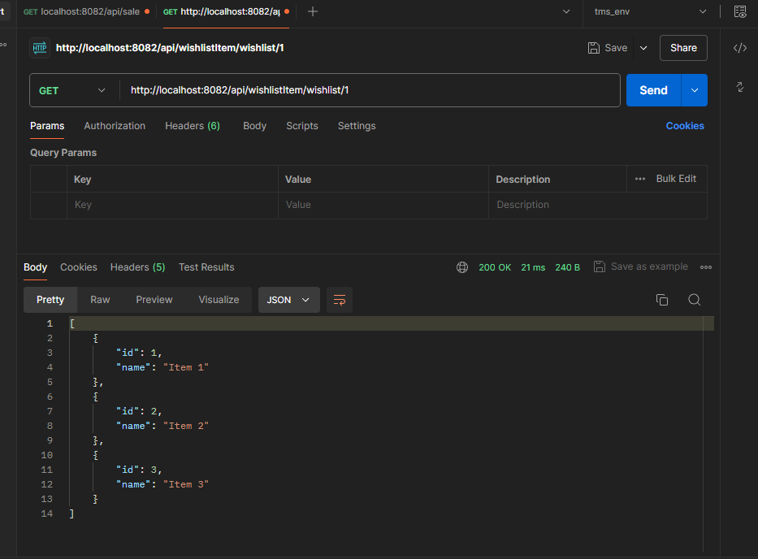
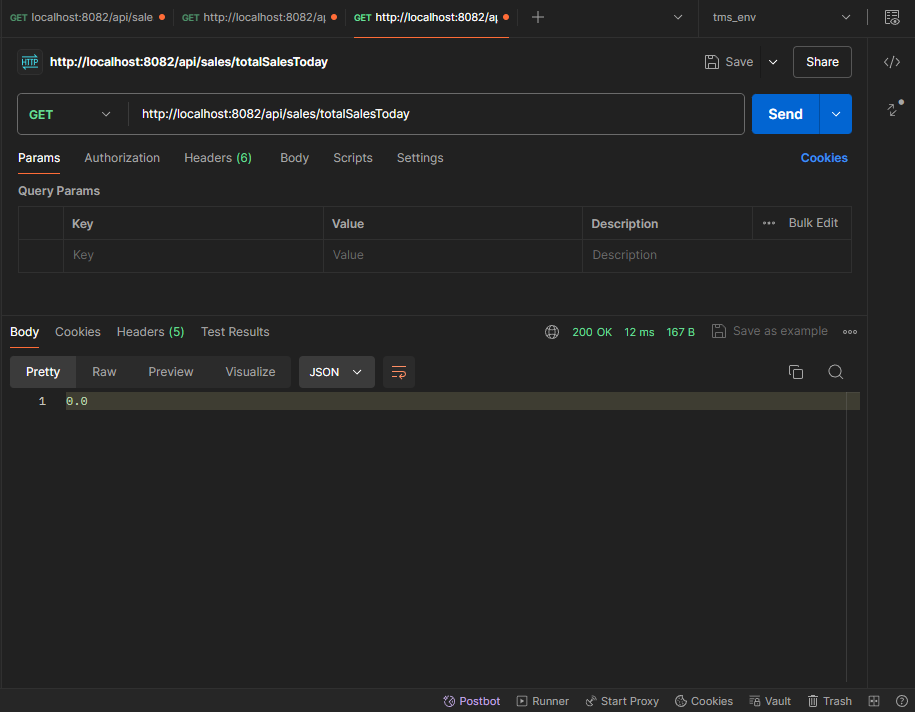
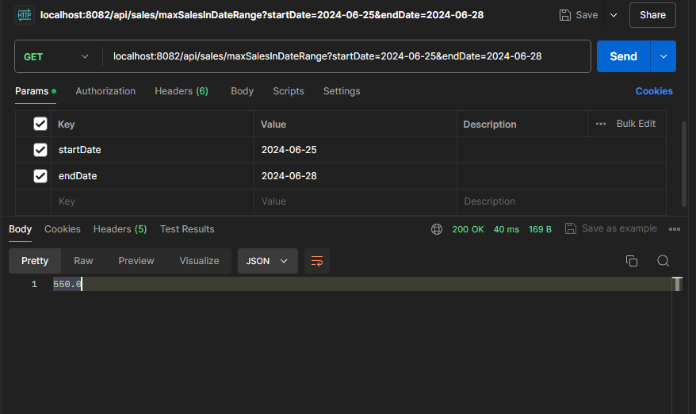
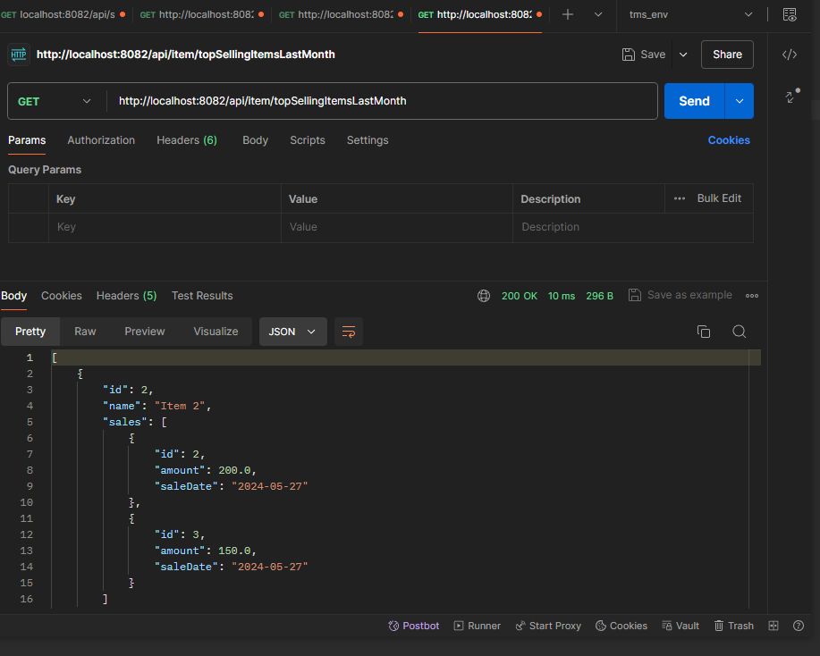
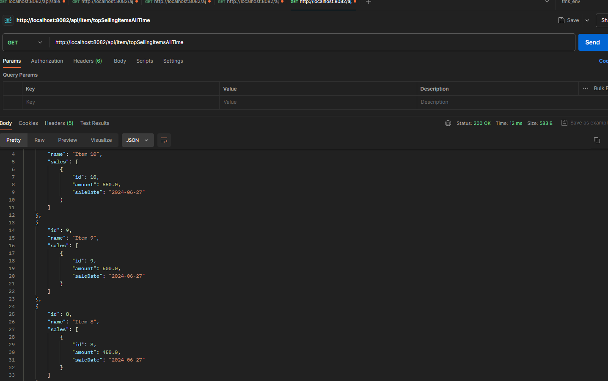

# ecommerce-application
This a E-commerce Application That is Based on Spring boot Framework

# how to run the application
1. clone the repository
2. open the project in your favourite IDE
3. use postgresql as the database
4. create a database named `wsd-ecommerce`
5. run the application
6. use postman to test the api

#Features
1. TDD approach
2. Restful API
3. Log visualization 
4. Exception handling
5. flyway for database migration

#APIs

Wishlist api

total sale by today api

max sale day of a certain time range api

top selling item last month api

top selling item all time api

